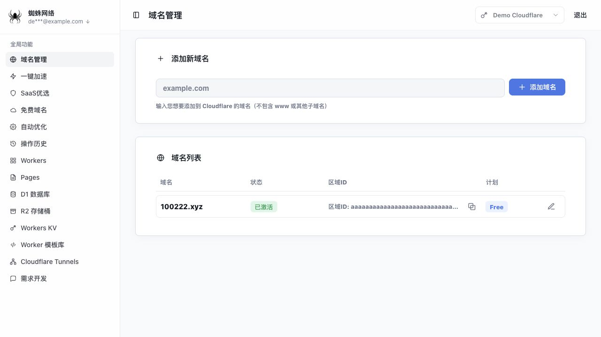
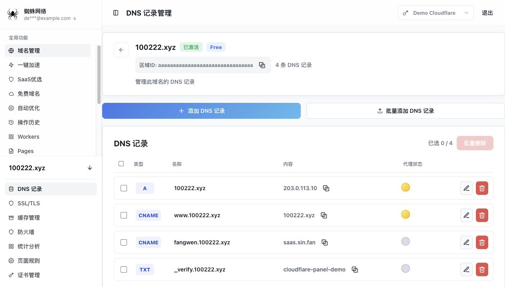
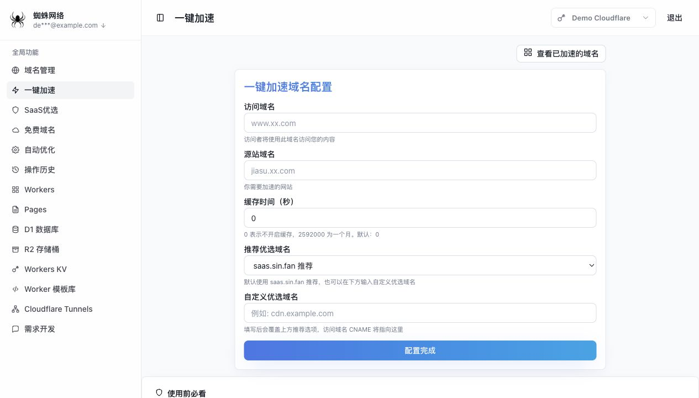
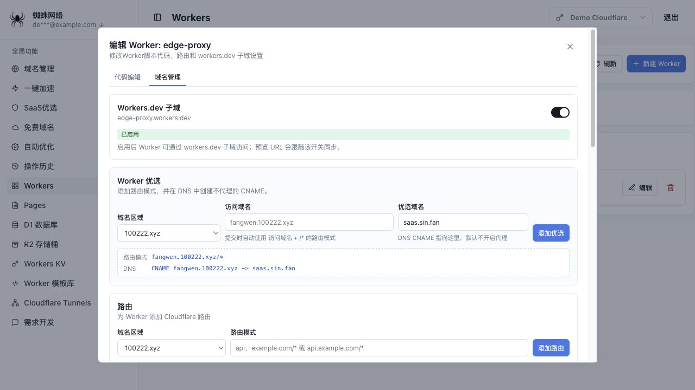

# Cloudflare Preferred Panel

一个 Docker-only 的 Cloudflare 第三方管理面板。面板通过服务端代理 Cloudflare API，支持多 Cloudflare 账号切换、DNS、单域名配置、Workers、Pages、D1、R2、KV、Tunnels 和一键加速工作流。

## 功能

- 首次初始化：第一次打开 `ip:端口` 时必须输入容器启动日志中的一次性初始化口令，再创建管理员账户并强制绑定 2FA。
- SQLite 持久化：管理员密码使用 scrypt 哈希保存；2FA 密钥和 Cloudflare Global API Key 使用 AES-GCM 加密后保存到 SQLite。
- 多账户管理：Cloudflare 账号保存在 SQLite，登录后可在顶部切换。
- 域名管理：读取当前账号所有 Zone，展示域名、状态、区域 ID、套餐，并支持新增 Zone。
- DNS 记录：读取、新增、编辑、删除和批量管理常用 DNS 记录。
- 单域名管理：提供 DNS、SSL/TLS、缓存、防火墙、统计分析、页面规则、证书管理页面。
- 一键加速：配置访问域名、源站域名、优选域名和 Cloudflare for SaaS 相关流程。
- Workers 与开发资源：管理 Workers、Pages、D1、R2、KV、Cloudflare Tunnels 和 Worker 模板库。
- 操作历史：记录管理操作结果，不记录请求体、密码、2FA 密钥或 Global API Key。

## 界面预览

截图使用本地 mock 数据生成，不包含真实 Cloudflare 账号或 API Key。

### 域名列表



### DNS 记录



### 一键加速



### Worker 优选



## Docker 运行

```bash
docker run -d \
  --name cloudflare-preferred-panel \
  --restart unless-stopped \
  -p 3000:3000 \
  -v cloudflare-panel-data:/data \
  baize233/network:latest
```

然后打开：

```text
http://服务器IP:3000
```

首次打开会进入两页初始化流程：

1. 查看容器日志中的 `Initial setup token` 提示。默认不会输出完整口令，需要进入容器读取 `/data/setup-token.txt`。
2. 在第 1 页输入初始化口令，生成并保存 2FA 登录密钥到身份验证器。
3. 创建管理员用户名和密码，输入当前 6 位 2FA 验证码确认绑定。
4. 在第 2 页录入一个或多个 Cloudflare 账号名称、登录邮箱和 Global API Key。
5. 保存后进入管理面板，后续可在顶部切换当前 Cloudflare 账号。

不再通过 `.env`、`USER/PASSWORD/AUTH`、`EMAILn/CF_APIn` 配置敏感信息。

## 可选环境变量

`.env.example` 只保留非敏感运行参数：

```bash
PORT=3000
DATA_DIR=/data
SESSION_TTL_DAYS=30
SECURE_COOKIES=false
PUBLIC_ORIGIN=
TRUST_PROXY_HEADERS=false
CLOUDFLARE_REQUEST_TIMEOUT_MS=15000
ENABLE_D1_SQL_CONSOLE=false
ENABLE_D1_SQL_MUTATIONS=false
RATE_LIMIT_ATTEMPTS=8
RATE_LIMIT_WINDOW_MS=900000
```

使用 `.env` 时：

```bash
docker run -d \
  --name cloudflare-preferred-panel \
  --restart unless-stopped \
  --env-file .env \
  -p 3000:3000 \
  -v cloudflare-panel-data:/data \
  baize233/network:latest
```

## 常用教程

下面命令默认容器名为 `cloudflare-preferred-panel`，数据卷为 `cloudflare-panel-data`。执行会修改 SQLite 的操作前，先备份。

### 查看首次初始化口令

默认情况下，完整初始化口令不会写入日志，只会写入容器内文件：

```bash
docker logs cloudflare-preferred-panel
docker exec cloudflare-preferred-panel cat /data/setup-token.txt
```

如果启动时显式设置了 `SETUP_TOKEN`，则使用你配置的值，不会生成 `/data/setup-token.txt`。

### 重置管理员账号、密码和 2FA

当前版本没有单独的“修改密码”接口。忘记管理员密码或丢失 2FA 时，需要清空管理员记录并重新走第 1 页初始化；已保存的 Cloudflare 账号会保留。

```bash
docker stop cloudflare-preferred-panel

docker run --rm \
  -v cloudflare-panel-data:/data \
  -v "$PWD":/backup \
  alpine sh -c 'cp /data/panel.sqlite* /backup/'

docker run --rm \
  -v cloudflare-panel-data:/data \
  baize233/network:latest \
  node --experimental-sqlite -e 'const { DatabaseSync } = require("node:sqlite"); const db = new DatabaseSync("/data/panel.sqlite"); db.exec("DELETE FROM panel_user;"); db.close();'

docker run --rm \
  -v cloudflare-panel-data:/data \
  alpine sh -c 'rm -f /data/setup-token.txt'

docker start cloudflare-preferred-panel
docker exec cloudflare-preferred-panel cat /data/setup-token.txt
```

然后打开面板，输入新的初始化口令，重新创建管理员用户名、密码和 2FA。因为 Cloudflare 账号表未删除，通常不需要重新录入 Cloudflare API Key；如果浏览器还停留在旧登录状态，清理 Cookie 后重新登录即可。

### 重置 Cloudflare API Key

如果 Cloudflare Global API Key 泄露、失效或要整体换账号，推荐清空已保存的 Cloudflare 账号，再通过初始化第 2 页重新录入。管理员账号和 2FA 会保留。

```bash
docker stop cloudflare-preferred-panel

docker run --rm \
  -v cloudflare-panel-data:/data \
  -v "$PWD":/backup \
  alpine sh -c 'cp /data/panel.sqlite* /backup/'

docker run --rm \
  -v cloudflare-panel-data:/data \
  baize233/network:latest \
  node --experimental-sqlite -e 'const { DatabaseSync } = require("node:sqlite"); const db = new DatabaseSync("/data/panel.sqlite"); db.exec("DELETE FROM cloudflare_accounts;"); db.close();'

docker start cloudflare-preferred-panel
```

重新打开面板并登录管理员账号后，会进入 Cloudflare 账号添加页，录入新的邮箱和 Global API Key。

### 完全重新初始化

如果要同时重置管理员、2FA 和全部 Cloudflare 账号：

```bash
docker stop cloudflare-preferred-panel

docker run --rm \
  -v cloudflare-panel-data:/data \
  -v "$PWD":/backup \
  alpine sh -c 'cp /data/panel.sqlite* /backup/ && cp /data/secret.key /backup/secret.key.before-full-reset'

docker run --rm \
  -v cloudflare-panel-data:/data \
  alpine sh -c 'rm -f /data/panel.sqlite /data/panel.sqlite-* /data/setup-token.txt'

docker start cloudflare-preferred-panel
docker exec cloudflare-preferred-panel cat /data/setup-token.txt
```

注意不要随便删除 `/data/secret.key`。如果只是重新初始化，可以保留它；如果你也更换了外部 `PANEL_SECRET_KEY_FILE`，旧数据库里的敏感字段将无法解密。

### 备份和恢复

备份：

```bash
docker run --rm \
  -v cloudflare-panel-data:/data \
  -v "$PWD":/backup \
  alpine sh -c 'cp /data/panel.sqlite* /backup/ && cp /data/secret.key /backup/secret.key.backup'
```

恢复：

```bash
docker stop cloudflare-preferred-panel

docker run --rm \
  -v cloudflare-panel-data:/data \
  -v "$PWD":/backup \
  alpine sh -c 'rm -f /data/panel.sqlite /data/panel.sqlite-* && cp /backup/panel.sqlite* /data/ && cp /backup/secret.key.backup /data/secret.key'

docker start cloudflare-preferred-panel
```

如果使用 `PANEL_SECRET_KEY_FILE`，要单独备份和保护那个外部密钥文件，不要只备份 SQLite。

### 升级镜像

```bash
docker pull baize233/network:latest
docker stop cloudflare-preferred-panel
docker rm cloudflare-preferred-panel
docker run -d \
  --name cloudflare-preferred-panel \
  --restart unless-stopped \
  -p 3000:3000 \
  -v cloudflare-panel-data:/data \
  baize233/network:latest
```

使用 compose 时：

```bash
docker compose pull
docker compose up -d
```

### 查看日志和健康状态

```bash
docker logs --tail 200 cloudflare-preferred-panel
docker inspect --format='{{json .State.Health}}' cloudflare-preferred-panel
```

## 项目结构

```text
src/
  app.js                               # HTTP 应用组装
  bootstrap.js                         # 依赖组装
  server.js                            # 服务启动入口
  config/                              # 非敏感运行配置
  controllers/                         # HTTP 控制器
  routes/                              # API 路由
  services/                            # 鉴权、SQLite、Cloudflare 服务
  middleware/                          # 静态资源等边界处理
  lib/                                 # 通用 HTTP 工具
public/                                # 前端静态资源
test/                                  # Node test 测试
```

## 测试

```bash
node --test test/**/*.test.js
```

## 安全说明

浏览器只保存最长 30 天的 HttpOnly 随机会话 Cookie。所有状态修改接口要求 CSRF token；静态页和 JSON 响应带 CSP、`X-Frame-Options`、`nosniff` 等安全头。Cookie、localStorage、sessionStorage、接口响应和操作历史都不保存 Cloudflare Global API Key、管理员密码或 2FA 密钥。

`/data/secret.key` 是 SQLite 敏感字段加密密钥，泄露等级等同敏感凭据。生产环境建议用 `PANEL_SECRET_KEY_FILE` 从 Docker secret 或独立只读挂载提供密钥材料，让密钥和 `/data/panel.sqlite` 分开存放；只泄露 SQLite 文件时无法直接读出 2FA seed 或 Cloudflare Global API Key。

D1 SQL 控制台默认关闭。设置 `ENABLE_D1_SQL_CONSOLE=true` 后默认只允许单条 `SELECT/WITH` 查询；只有额外设置 `ENABLE_D1_SQL_MUTATIONS=true` 才允许写入或 DDL 语句。

生产环境建议放在 HTTPS 反向代理后，并挂载 `/data` 做持久化备份。完整 Docker 部署、升级、备份和回滚流程见 [DEPLOYMENT.md](./DEPLOYMENT.md)。

## License

MIT
